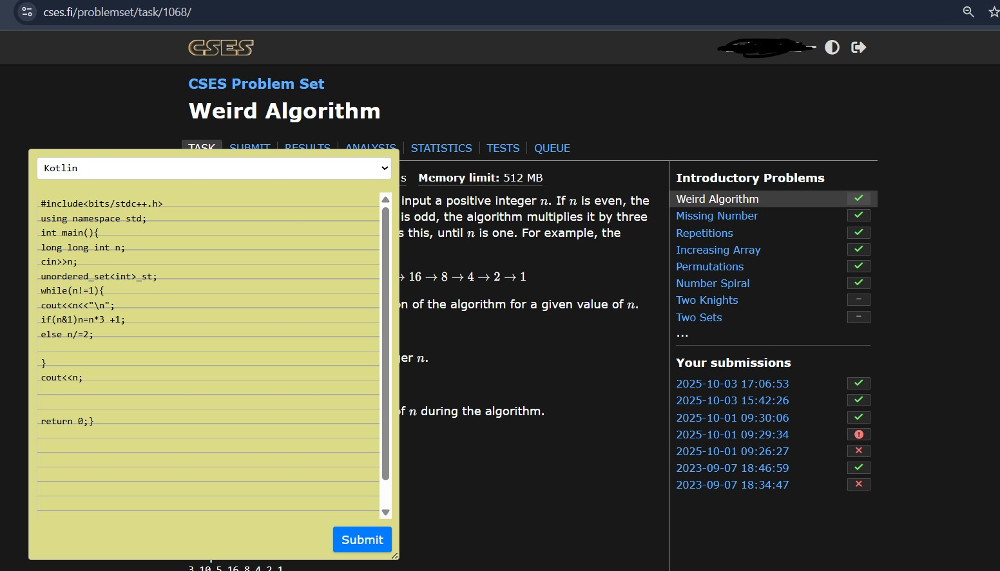

## CSES Hook Chrome Extension

**CSES Hook** is a Chrome extension designed to enhance your experience on the [CSES Problem Set](https://cses.fi/problemset/) platform. It provides a convenient, real-time code editor directly on the CSES website, so you can write, edit, and test your code without the need to upload files or switch between tabs.

### Features
- 📝 **Inline Code Editor:** Write and edit code directly on the CSES problem page.
- ⚡ **Real-Time Experience:** No need to upload files—just start coding instantly.
- 💾 **Auto-Save:** Your code is saved automatically in your browser, so you never lose your progress.
- 🔒 **Privacy-Friendly:** All code stays on your device; nothing is uploaded or shared.

### Installation
1. Download or clone this repository.
2. Open Chrome and go to `chrome://extensions/`.
3. Enable **Developer mode** (top right corner).
4. Click **Load unpacked** and select the folder containing this extension.

### Usage
1. Visit any problem on [CSES Problem Set](https://cses.fi/problemset/).
2. The code editor will appear on the page.
3. Start writing your solution in real time—no uploads required!

### Screenshot

### Contributing
Contributions are welcome! Feel free to open issues or submit pull requests.

### License
This project is licensed under the MIT License.